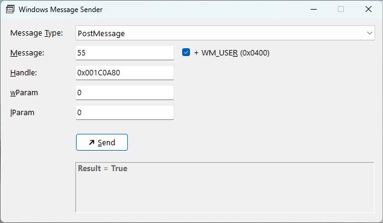
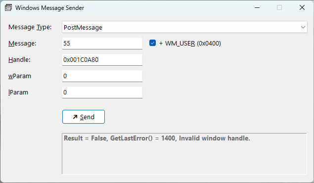

# Windows Message Sender

A very small Windows utility to send win32 (initially PostMessage & SendMessage) custom windows messages (WM_USER + ?) to a known window handle. Used in conjuction with tools like AutoIt to support desktop automation tasks. On failure the application will display useful error information via GetLastError() and FormatMessage().

### When it works... ###

### When it doesn't... ###

